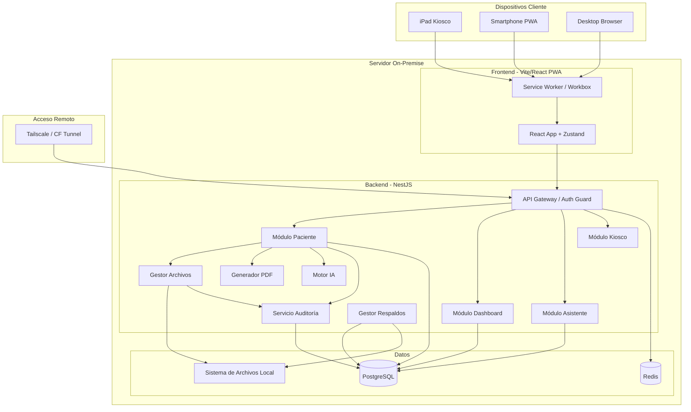
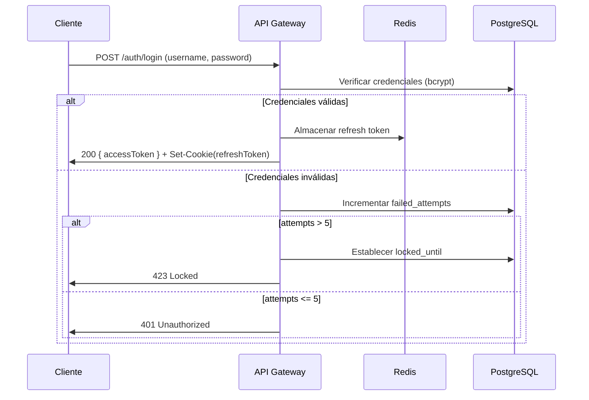

# Documento de Diseño Técnico

## Overview

Sistema de Gestión Clínica enterprise-grade desplegado On-Premise, construido como monorepo con arquitectura de capas separadas (frontend PWA + backend API + base de datos PostgreSQL). El sistema gestiona expedientes clínicos electrónicos, multimedia médica, prescripciones, citas y generación de documentos PDF, cumpliendo con NOM-004-SSA3-2012 y LFPDPPP.

### Stack Tecnológico

| Capa | Tecnología |
|------|-----------|
| Frontend | React 18+ (Vite), TypeScript, Tailwind CSS, Framer Motion |
| Backend | Node.js + NestJS (TypeScript) |
| Base de Datos | PostgreSQL 16+ |
| Cache | Redis (sesiones, búsqueda) |
| ORM | Prisma |
| Autenticación | JWT (access + refresh tokens) |
| PDF | pdf-lib + sharp |
| IA | OpenAI API (configurable, con fallback local) |
| PWA | Workbox |
| Pruebas | Vitest + fast-check (PBT) |

### Decisiones Arquitectónicas Clave

1. **Monorepo con Turborepo**: Código compartido entre frontend y backend (tipos, validaciones, constantes).
2. **NestJS sobre FastAPI**: Ecosistema TypeScript unificado, tipado end-to-end, mejor DX para PWA.
3. **Archivos en filesystem local**: DB almacena solo metadatos/rutas — cumple requisito de control total On-Premise.
4. **Audit log inmutable**: Tabla append-only con permisos PostgreSQL restrictivos (REVOKE UPDATE, DELETE).
5. **White-label via JSON hot-reload**: Polling cada 30s desde frontend, sin reinicio de servidor.


## Architecture

### Estructura del Monorepo

```
historial_clinico/
├── apps/
│   ├── web/                    # Frontend React PWA
│   │   ├── src/
│   │   │   ├── modules/        # Feature modules
│   │   │   ├── shared/         # Componentes compartidos
│   │   │   ├── hooks/          # Custom hooks
│   │   │   ├── stores/         # Zustand stores
│   │   │   ├── services/       # API client layer
│   │   │   └── theme/          # White-label + dark mode
│   │   ├── public/
│   │   └── vite.config.ts
│   └── api/                    # Backend NestJS
│       ├── src/
│       │   ├── modules/        # Módulos NestJS por dominio
│       │   ├── common/         # Guards, interceptors, pipes
│       │   ├── database/       # Prisma service, migrations
│       │   └── jobs/           # Cron jobs (backups)
│       └── nest-cli.json
├── packages/
│   ├── shared-types/           # Tipos TypeScript compartidos
│   ├── validators/             # Zod schemas (frontend + backend)
│   └── constants/              # Límites, formatos, roles
├── prisma/
│   ├── schema.prisma
│   └── migrations/
├── docker-compose.yml
├── turbo.json
└── package.json
```

### Diagrama de Arquitectura de Alto Nivel




### Flujo de Datos Principal

1. **Request entrante** → Nginx reverse proxy → NestJS (puerto 3000)
2. **Auth Guard** verifica JWT en header `Authorization: Bearer <token>`
3. **Role Guard** valida permisos del rol contra el endpoint solicitado
4. **Audit Interceptor** registra la acción pre/post ejecución
5. **Controller** delega a Service → Repository (Prisma) → PostgreSQL
6. **Response** serializada con class-transformer, sin campos sensibles

### Estrategia de Comunicación

| Patrón | Uso |
|--------|-----|
| REST API (JSON) | Todas las operaciones CRUD |
| Server-Sent Events (SSE) | Notificaciones en tiempo real (prescripciones al asistente) |
| Polling (30s) | Cambios de tema white-label |
| Service Worker Cache | Lectura offline de datos previamente consultados |

---

## Components and Interfaces

### Módulos Backend (NestJS)

#### 1. AuthModule
- **AuthController**: `POST /auth/login`, `POST /auth/refresh`, `POST /auth/logout`
- **AuthService**: Validación de credenciales, generación JWT, bloqueo de cuentas
- **Guards**: `JwtAuthGuard`, `RolesGuard`
- **Dependencias**: Redis (sesiones), AuditService

#### 2. PatientModule
- **PatientController**: CRUD pacientes, notas clínicas, prescripciones
- **PatientService**: Lógica de negocio, detección de duplicados
- **Dependencias**: FileModule, AuditService, PrismaService

#### 3. FileModule
- **FileController**: Upload, download, delete de archivos
- **FileService**: Validación MIME/tamaño, checksum, watermark, nombre único
- **WatermarkService**: Aplica logo + ID paciente sobre imágenes/videos (sharp/ffmpeg)
- **DiskSpaceService**: Monitoreo de espacio disponible

#### 4. DashboardModule
- **DoctorDashController**: Citas del día, próximo paciente, búsqueda global
- **AssistantDashController**: Citas con materiales, bandeja prescripciones

#### 5. KioskModule
- **KioskController**: Registro wizard, firma digital, detección duplicados
- **KioskService**: Timeout/cleanup automático, creación de paciente

#### 6. PDFModule
- **PDFController**: Generación de prescripciones/documentos con membrete
- **PDFService**: Inyección de datos en coordenadas de plantilla (pdf-lib)
- **TemplateService**: Carga y validación de plantillas de membrete

#### 7. AIModule
- **AIController**: `POST /ai/summary/:patientId`
- **AIService**: Recopila historial, llama a LLM, estructura respuesta
- **Timeout**: 30s máximo, retry con backoff

#### 8. BackupModule
- **BackupService**: Cron job mensual, pg_dump, tar.gz, AES-256
- **BackupScheduler**: `@Cron('0 2 1 * *')`

#### 9. AuditModule
- **AuditService**: Registro inmutable de acciones
- **AuditInterceptor**: Interceptor global NestJS (pre/post request)

#### 10. ThemeModule
- **ThemeController**: `GET /theme/current`, `PUT /theme/config`
- **ThemeService**: Lectura/validación de JSON de tema, fallback a defaults


### Módulos Frontend (React)

#### Estructura de Módulos

```
src/modules/
├── auth/               # Login, session management
├── patient/            # Perfil, expediente, galería, notas
├── dashboard/
│   ├── doctor/         # Dashboard doctor
│   └── assistant/      # Dashboard asistente
├── kiosk/              # Modo kiosco iPad
├── prescriptions/      # Bandeja y generación PDF
├── settings/           # White-label, usuarios, backup status
└── shared/
    ├── components/     # Button, Input, Modal, Card, Skeleton
    ├── layouts/        # MainLayout, KioskLayout, AuthLayout
    └── animations/     # Framer Motion variants reutilizables
```

#### Componentes de UI Compartidos

| Componente | Responsabilidad |
|-----------|----------------|
| `GlassCard` | Contenedor con efecto glassmorphism configurable |
| `SkeletonLoader` | Placeholder animado durante carga (>300ms) |
| `PageTransition` | Wrapper Framer Motion (200-400ms) |
| `FileUploader` | Drag & drop con validación, progress bar |
| `BeforeAfterSlider` | Comparador de imágenes interactivo |
| `SignaturePad` | Canvas táctil para firma digital |
| `SearchInput` | Debounced (500ms), resultados dropdown |
| `WhatsAppButton` | Genera enlace wa.me pre-llenado |
| `ThemeProvider` | Context con polling de tema white-label |
| `OfflineBanner` | Indicador de modo sin conectividad |

### Interfaces TypeScript Compartidas (packages/shared-types)

```typescript
// Roles del sistema
export type UserRole = 'doctor' | 'assistant' | 'admin' | 'kiosk';

// Permisos por módulo
export interface RolePermissions {
  patient: { read: boolean; write: boolean };
  dashboard_doctor: { read: boolean };
  dashboard_assistant: { read: boolean };
  kiosk: { read: boolean; write: boolean };
  whitelabel: { read: boolean; write: boolean };
  audit: { read: boolean };
  ai: { read: boolean };
}

// Configuración de tema
export interface ThemeConfig {
  clinicName: string;
  logoUrl: string;
  primaryColor: string;    // hex
  secondaryColor: string;  // hex
  accentColor: string;     // hex
  fontFamily: string;
  darkMode: boolean;
}

// Metadatos de archivo
export interface FileMetadata {
  id: string;
  patientId: string;
  originalName: string;
  uniqueName: string;
  storagePath: string;
  mimeType: string;
  sizeBytes: number;
  uploadedAt: string;      // ISO 8601
  uploadedBy: string;
  checksum: string;
  category: 'pdf' | 'image' | 'video';
  studyType?: string;
  captureDate?: string;
  anatomicalZone?: string;
  notes?: string;
}
```


### API REST — Endpoints Principales

#### Autenticación (`/api/auth`)
| Método | Ruta | Descripción | Roles |
|--------|------|-------------|-------|
| POST | `/auth/login` | Iniciar sesión | Público |
| POST | `/auth/refresh` | Renovar token | Autenticado |
| POST | `/auth/logout` | Cerrar sesión | Autenticado |

#### Pacientes (`/api/patients`)
| Método | Ruta | Descripción | Roles |
|--------|------|-------------|-------|
| GET | `/patients` | Listar pacientes (paginado) | Doctor, Asistente, Admin |
| GET | `/patients/:id` | Detalle de paciente | Doctor, Asistente(lectura), Admin |
| POST | `/patients` | Crear paciente | Doctor, Asistente, Kiosco, Admin |
| PATCH | `/patients/:id` | Actualizar paciente | Doctor, Asistente, Admin |
| GET | `/patients/search?q=` | Búsqueda por nombre (<500ms) | Doctor, Admin |
| GET | `/patients/:id/check-duplicate` | Verificar duplicado | Doctor, Asistente, Kiosco |

#### Expediente Digital (`/api/patients/:id/documents`)
| Método | Ruta | Descripción | Roles |
|--------|------|-------------|-------|
| GET | `/patients/:id/documents` | Listar PDFs (paginado 20) | Doctor, Admin |
| POST | `/patients/:id/documents` | Subir PDF | Doctor, Admin |
| GET | `/patients/:id/documents/:docId/preview` | Vista previa | Doctor, Admin |
| DELETE | `/patients/:id/documents/:docId` | Eliminar PDF | Doctor, Admin |

#### Galería Multimedia (`/api/patients/:id/gallery`)
| Método | Ruta | Descripción | Roles |
|--------|------|-------------|-------|
| GET | `/patients/:id/gallery` | Timeline multimedia | Doctor, Admin |
| POST | `/patients/:id/gallery` | Subir foto/video | Doctor, Admin |
| GET | `/patients/:id/gallery/compare` | Comparación antes/después | Doctor, Admin |

#### Notas Clínicas (`/api/patients/:id/notes`)
| Método | Ruta | Descripción | Roles |
|--------|------|-------------|-------|
| GET | `/patients/:id/notes` | Listar notas (desc) | Doctor, Admin |
| POST | `/patients/:id/notes` | Crear nota | Doctor, Admin |

#### Prescripciones (`/api/prescriptions`)
| Método | Ruta | Descripción | Roles |
|--------|------|-------------|-------|
| POST | `/prescriptions` | Crear prescripción | Doctor, Admin |
| GET | `/prescriptions/inbox` | Bandeja asistente | Asistente, Admin |
| PATCH | `/prescriptions/:id/complete` | Marcar completada | Asistente, Admin |
| GET | `/prescriptions/:id/pdf` | Generar PDF con membrete | Asistente, Doctor, Admin |

#### Dashboard (`/api/dashboard`)
| Método | Ruta | Descripción | Roles |
|--------|------|-------------|-------|
| GET | `/dashboard/doctor/today` | Citas del día doctor | Doctor, Admin |
| GET | `/dashboard/doctor/next-patient` | Próximo paciente | Doctor, Admin |
| GET | `/dashboard/assistant/today` | Citas + materiales | Asistente, Admin |

#### IA (`/api/ai`)
| Método | Ruta | Descripción | Roles |
|--------|------|-------------|-------|
| POST | `/ai/summary/:patientId` | Generar resumen clínico | Doctor, Admin |

#### Kiosco (`/api/kiosk`)
| Método | Ruta | Descripción | Roles |
|--------|------|-------------|-------|
| POST | `/kiosk/register` | Registrar paciente + firma | Kiosco |
| GET | `/kiosk/privacy-notice` | Obtener aviso privacidad | Kiosco |

#### Tema (`/api/theme`)
| Método | Ruta | Descripción | Roles |
|--------|------|-------------|-------|
| GET | `/theme/current` | Configuración activa | Público |
| PUT | `/theme/config` | Actualizar tema | Admin |

#### Respaldos (`/api/backups`)
| Método | Ruta | Descripción | Roles |
|--------|------|-------------|-------|
| GET | `/backups` | Listar respaldos | Admin |
| POST | `/backups/trigger` | Ejecutar respaldo manual | Admin |
| GET | `/backups/:id/status` | Estado de respaldo | Admin |

#### Auditoría (`/api/audit`)
| Método | Ruta | Descripción | Roles |
|--------|------|-------------|-------|
| GET | `/audit/logs` | Consultar logs (paginado, filtros) | Admin |


---

## Data Models

### Diagrama Entidad-Relación

```mermaid
erDiagram
    User ||--o{ AuditLog : generates
    User ||--o{ ClinicalNote : authors
    User ||--o{ Prescription : creates
    User ||--o{ FileMetadata : uploads
    Patient ||--o{ ClinicalNote : has
    Patient ||--o{ Prescription : receives
    Patient ||--o{ FileMetadata : owns
    Patient ||--o{ Appointment : attends
    Patient ||--o{ Allergy : has
    Patient ||--o{ PreviousSurgery : has
    Appointment ||--o{ AppointmentMaterial : requires
    Prescription }o--|| User : "assigned_to"
    ThemeConfig ||--|| Clinic : belongs_to

    User {
        uuid id PK
        string username UK
        string password_hash
        enum role "doctor|assistant|admin|kiosk"
        string full_name
        string email
        boolean is_active
        int failed_login_attempts
        timestamp locked_until
        timestamp created_at
        timestamp updated_at
    }

    Patient {
        uuid id PK
        string full_name
        date birth_date
        enum sex "M|F|O"
        string phone
        string email
        string address
        enum blood_type
        string emergency_contact_name
        string emergency_contact_phone
        string emergency_contact_relation
        string insurance_provider
        string insurance_policy_number
        string profile_photo_path
        timestamp created_at
        timestamp updated_at
    }

    Allergy {
        uuid id PK
        uuid patient_id FK
        string description "max 200 chars"
        timestamp created_at
    }

    PreviousSurgery {
        uuid id PK
        uuid patient_id FK
        string name
        date surgery_date
        timestamp created_at
    }

    ClinicalNote {
        uuid id PK
        uuid patient_id FK
        uuid author_id FK
        text content "max 10000 chars"
        timestamp created_at
    }

    Prescription {
        uuid id PK
        uuid patient_id FK
        uuid doctor_id FK
        uuid assigned_to FK "asistente"
        text content
        enum status "pending|read|completed"
        timestamp read_at
        timestamp completed_at
        timestamp created_at
    }

    Appointment {
        uuid id PK
        uuid patient_id FK
        uuid doctor_id FK
        date appointment_date
        time appointment_time
        string reason
        enum status "scheduled|in_progress|completed|cancelled"
        timestamp created_at
        timestamp updated_at
    }

    AppointmentMaterial {
        uuid id PK
        uuid appointment_id FK
        string material_name
        int quantity
        string notes
    }

    FileMetadata {
        uuid id PK
        uuid patient_id FK
        uuid uploaded_by FK
        string original_name
        string unique_name
        string storage_path
        string mime_type
        bigint size_bytes
        string checksum "SHA-256"
        enum category "pdf|image|video"
        string study_type
        date capture_date
        string anatomical_zone
        string notes
        boolean has_watermark
        timestamp uploaded_at
    }

    AuditLog {
        bigserial id PK
        uuid user_id
        enum user_role
        enum action "create|read|update|delete"
        string entity_table
        string entity_id
        string description
        string ip_address
        enum result "success|failure"
        jsonb metadata
        timestamp created_at "ISO 8601"
    }

    ThemeConfig {
        uuid id PK
        uuid clinic_id FK
        string clinic_name
        string logo_path
        string primary_color
        string secondary_color
        string accent_color
        string font_family
        jsonb raw_config
        timestamp updated_at
    }

    Clinic {
        uuid id PK
        string name
        string address
        string phone
        jsonb privacy_notice
        jsonb letterhead_config "coordenadas PDF"
        timestamp created_at
    }

    BackupRecord {
        uuid id PK
        timestamp executed_at
        bigint size_bytes
        string file_path
        string checksum "SHA-256"
        enum status "success|failed|retrying"
        string error_message
        timestamp created_at
    }

    SignatureRecord {
        uuid id PK
        uuid patient_id FK
        string signature_image_path
        string document_type "privacy_notice"
        timestamp signed_at
    }
```




### Configuración de Coordenadas para Generación PDF

La tabla `Clinic.letterhead_config` almacena un JSON con las coordenadas (x, y) y dimensiones para inyectar datos en el membrete:

```json
{
  "pageSize": "letter",
  "margins": { "top": 80, "right": 40, "bottom": 60, "left": 40 },
  "fields": {
    "patientName": { "x": 120, "y": 680, "fontSize": 12, "font": "Helvetica-Bold" },
    "date": { "x": 420, "y": 680, "fontSize": 10, "font": "Helvetica" },
    "content": { "x": 40, "y": 620, "fontSize": 11, "font": "Helvetica", "maxWidth": 520, "lineHeight": 14 },
    "doctorSignature": { "x": 200, "y": 100, "fontSize": 10, "font": "Helvetica" },
    "footer": { "x": 40, "y": 40, "fontSize": 8, "font": "Helvetica" }
  },
  "templatePdfPath": "/templates/letterhead.pdf"
}
```

### Estrategia de Índices PostgreSQL

```sql
-- Búsqueda de pacientes por nombre (trigram para búsqueda parcial)
CREATE INDEX idx_patients_name_trgm ON patients USING gin (full_name gin_trgm_ops);

-- Citas del día
CREATE INDEX idx_appointments_date_doctor ON appointments (appointment_date, doctor_id);

-- Archivos por paciente
CREATE INDEX idx_files_patient_category ON file_metadata (patient_id, category);

-- Notas por paciente (cronológico)
CREATE INDEX idx_notes_patient_date ON clinical_notes (patient_id, created_at DESC);

-- Prescripciones pendientes del asistente
CREATE INDEX idx_prescriptions_assignee_status ON prescriptions (assigned_to, status)
  WHERE status IN ('pending', 'read');

-- Audit log por fecha (particionado mensual recomendado)
CREATE INDEX idx_audit_created ON audit_logs (created_at DESC);
CREATE INDEX idx_audit_user ON audit_logs (user_id, created_at DESC);
```

### Tabla de Auditoría — Inmutabilidad

```sql
-- Prevenir UPDATE y DELETE a nivel de base de datos
REVOKE UPDATE, DELETE ON audit_logs FROM app_user;

-- Trigger adicional de seguridad
CREATE OR REPLACE FUNCTION prevent_audit_modification()
RETURNS TRIGGER AS $$
BEGIN
  RAISE EXCEPTION 'audit_logs table is immutable: % operations are not allowed', TG_OP;
END;
$$ LANGUAGE plpgsql;

CREATE TRIGGER audit_immutable_guard
  BEFORE UPDATE OR DELETE ON audit_logs
  FOR EACH ROW EXECUTE FUNCTION prevent_audit_modification();
```

### Estructura de Almacenamiento de Archivos

```
/data/clinic-files/
├── patients/
│   ├── {patient-uuid}/
│   │   ├── documents/       # PDFs de estudios
│   │   │   └── 2024-01-15_estudio-sangre_abc123.pdf
│   │   ├── gallery/
│   │   │   ├── images/      # Fotos (con watermark si aplica)
│   │   │   └── videos/      # Videos (con watermark si aplica)
│   │   ├── signatures/      # Firma digital del paciente
│   │   └── profile/         # Foto de perfil
├── templates/
│   └── letterhead.pdf       # Membrete de la clínica
├── backups/
│   └── 2024-01-01_backup_encrypted.tar.gz.enc
└── theme/
    └── logo.png
```

### Convención de Nombres de Archivo

```
{YYYY-MM-DD}_{tipo-documento}_{uuid-corto}.{ext}
```

Ejemplo: `2024-03-15_radiografia-torax_a1b2c3.pdf`


---

## Correctness Properties

*Una propiedad es una característica o comportamiento que debe mantenerse verdadero en todas las ejecuciones válidas de un sistema — esencialmente, una declaración formal sobre lo que el sistema debe hacer. Las propiedades sirven como puente entre especificaciones legibles por humanos y garantías de correctitud verificables por máquina.*

### Property 1: Validación de campos obligatorios del paciente

*Para cualquier* objeto de datos de paciente, la validación SHALL aceptar el objeto si y solo si contiene nombre completo no vacío, fecha de nacimiento no futura, sexo válido (M/F/O) y teléfono con al menos 10 dígitos; en caso contrario SHALL rechazarlo con un mensaje de error asociado al campo específico que falla, sin descartar los datos válidos ingresados.

**Validates: Requirements 1.3, 1.4, 7.4**

### Property 2: Límites de datos en creación de paciente

*Para cualquier* conjunto de datos de paciente, la creación SHALL ser rechazada si contiene más de 50 alergias, alguna alergia con más de 200 caracteres, más de 30 cirugías previas, o una foto de perfil que exceda 5 MB o no sea JPEG/PNG; el mensaje de error SHALL indicar el límite específico superado.

**Validates: Requirements 1.1**

### Property 3: Detección de paciente duplicado

*Para cualquier* par de registros de paciente, el sistema SHALL detectar un posible duplicado si y solo si el nombre completo (case-insensitive, normalizado) y la fecha de nacimiento son idénticos entre ambos registros.

**Validates: Requirements 1.5, 7.6**

### Property 4: Validación compuesta de archivos

*Para cualquier* archivo subido al sistema, la validación SHALL aceptarlo si y solo si: (a) su tipo MIME está en la lista permitida (application/pdf, image/jpeg, image/png, image/heic, video/mp4, video/quicktime), (b) su tamaño no excede el límite correspondiente a su categoría (PDF: 20MB, imagen: 50MB, video: 200MB, general: 500MB), y (c) su checksum de integridad es válido. Para cualquier archivo rechazado, el mensaje SHALL indicar el motivo específico (formato, tamaño o integridad).

**Validates: Requirements 2.4, 3.5, 3.6, 12.3, 12.5**

### Property 5: Detección de nombre de archivo duplicado

*Para cualquier* archivo subido a un paciente, si ya existe un archivo con el mismo nombre en la misma categoría del mismo paciente, el sistema SHALL solicitar confirmación antes de reemplazar.

**Validates: Requirements 2.6**

### Property 6: Ordenamiento cronológico de listados

*Para cualquier* listado retornado por los endpoints de documentos, galería, notas clínicas y prescripciones de un paciente, los elementos SHALL estar ordenados por fecha descendente (más reciente primero); para citas del día (dashboard doctor y asistente), los elementos SHALL estar ordenados por hora ascendente.

**Validates: Requirements 2.3, 3.2, 4.4, 5.1, 6.3**

### Property 7: Paginación de documentos

*Para cualquier* listado de documentos PDF de un paciente, cada página SHALL contener como máximo 20 elementos, y la unión de todas las páginas SHALL contener exactamente todos los documentos del paciente sin duplicados ni omisiones.

**Validates: Requirements 2.3**


### Property 8: Validación de notas clínicas

*Para cualquier* string de contenido de nota clínica, la validación SHALL aceptarlo si y solo si su longitud es ≥ 1 y ≤ 10,000 caracteres; cadenas vacías o que excedan el límite SHALL ser rechazadas con un mensaje indicando la restricción incumplida.

**Validates: Requirements 4.1, 4.2**

### Property 9: Generación de URL WhatsApp

*Para cualquier* combinación válida de datos de paciente (nombre, teléfono) y cita (fecha, hora) y configuración de clínica (nombre), la URL generada SHALL seguir el formato `wa.me/{teléfono}?text={mensaje}` donde el mensaje contiene el nombre de la clínica, nombre del paciente, fecha y hora de la cita.

**Validates: Requirements 6.2**

### Property 10: Inyección de datos en PDF con membrete

*Para cualquier* combinación válida de datos de paciente y contenido de prescripción, y una configuración de coordenadas de membrete, el PDF generado SHALL contener como texto extraíble: el nombre del paciente, la fecha y el contenido de la prescripción.

**Validates: Requirements 6.4**

### Property 11: Registro de auditoría completo

*Para cualquier* acción registrada en el sistema, el registro de auditoría SHALL contener todos los campos requeridos: ID de usuario, rol del usuario, tipo de acción (create/read/update/delete), entidad afectada (tabla + registro), marca de tiempo ISO 8601, dirección IP y resultado (éxito/fallo).

**Validates: Requirements 8.1**

### Property 12: Control de acceso basado en roles (RBAC)

*Para cualquier* combinación de (rol de usuario, endpoint/módulo), el sistema SHALL permitir el acceso si y solo si la combinación está autorizada según la matriz de permisos definida: Doctor → {Paciente(RW), Dashboard_Doctor(R), IA(R)}; Asistente → {Asistente(RW), Paciente(R)}; Admin → {Todos(RW)}; Kiosco → {Kiosco(RW)}. Para cualquier acceso no autorizado, SHALL retornar HTTP 403 y registrar el intento.

**Validates: Requirements 8.3, 13.2, 13.5**

### Property 13: Round-trip de respaldo (compresión + encriptación)

*Para cualquier* conjunto de datos de entrada (dump de BD + archivos), el pipeline de respaldo (tar.gz + AES-256 encrypt) seguido de (decrypt + decompress) SHALL producir datos idénticos a los originales, verificable mediante comparación de checksum.

**Validates: Requirements 9.2**

### Property 14: Retención máxima de respaldos

*Para cualquier* lista de respaldos almacenados, después de ejecutar el proceso de limpieza, la cantidad de respaldos retenidos SHALL ser ≤ la cantidad máxima configurada (12 por defecto), y los eliminados SHALL ser siempre los más antiguos.

**Validates: Requirements 9.5**

### Property 15: Validación de esquema de tema

*Para cualquier* objeto JSON de configuración de tema, la validación SHALL aceptarlo si y solo si contiene: clinic_name (string no vacío), primary_color/secondary_color/accent_color (formato hex válido #RRGGBB), font_family (string no vacío), y logo (PNG/SVG, ≤2MB). Para configuraciones inválidas, el sistema SHALL usar valores por defecto.

**Validates: Requirements 10.1, 10.4**

### Property 16: Validación de contraseña

*Para cualquier* string de contraseña, la validación SHALL aceptarlo si y solo si tiene mínimo 8 caracteres e incluye al menos una letra mayúscula, una minúscula y un número.

**Validates: Requirements 13.1**

### Property 17: Bloqueo de cuenta por intentos fallidos

*Para cualquier* secuencia de N intentos de login fallidos consecutivos para una cuenta, si N > 5 el sistema SHALL bloquear la cuenta durante 15 minutos; si N ≤ 5 la cuenta SHALL permanecer activa.

**Validates: Requirements 13.4**

### Property 18: Estructura completa del resumen clínico IA

*Para cualquier* historial de paciente con al menos 1 nota de evolución, el resumen generado por el Motor_IA SHALL contener todas las secciones requeridas (diagnósticos, tratamientos realizados, alergias, recomendaciones) y SHALL incluir todos los diagnósticos registrados, todos los tratamientos, todas las alergias y las recomendaciones de las últimas 10 notas.

**Validates: Requirements 14.1, 14.3**

### Property 19: Ruta de almacenamiento por paciente

*Para cualquier* archivo almacenado en el sistema, su ruta SHALL contener el ID del paciente y seguir el patrón `/patients/{patient-id}/{category}/` donde category es una de: documents, gallery/images, gallery/videos, signatures, profile.

**Validates: Requirements 12.1**

### Property 20: Metadatos de archivo completos sin contenido binario

*Para cualquier* archivo registrado en la base de datos, el registro SHALL contener: nombre original, nombre único, ruta, tipo MIME, tamaño en bytes, fecha de subida, usuario que subió e ID de paciente; y SHALL NO contener campo de contenido binario.

**Validates: Requirements 12.2**

### Property 21: Persistencia de preferencia de modo oscuro/claro

*Para cualquier* preferencia de tema (light/dark) guardada por un usuario, al iniciar una nueva sesión el sistema SHALL presentar la interfaz con la misma preferencia previamente seleccionada.

**Validates: Requirements 11.3**

### Property 22: Búsqueda de pacientes con límite de resultados

*Para cualquier* query de búsqueda, los resultados SHALL contener como máximo 10 pacientes, y cada resultado SHALL tener coincidencia parcial con el query en el campo nombre completo.

**Validates: Requirements 5.3**


---

## Error Handling

### Estrategia por Capa

| Capa | Estrategia | Formato de Respuesta |
|------|-----------|---------------------|
| Controller | NestJS Exception Filters | `{ statusCode, error, message, details[] }` |
| Service | Excepciones de dominio tipadas | Propagación al controller |
| Repository | Catch de errores Prisma → dominio | `EntityNotFound`, `DuplicateEntry` |
| File System | Catch de I/O errors | `StorageError`, `InsufficientSpace` |
| External (IA) | Timeout + retry con backoff | `ServiceUnavailable` |

### Excepciones de Dominio

```typescript
// Base
export class DomainException extends Error {
  constructor(
    public readonly code: string,
    public readonly statusCode: number,
    message: string,
    public readonly details?: Record<string, unknown>
  ) { super(message); }
}

// Específicas
export class ValidationException extends DomainException {
  constructor(fields: { field: string; message: string }[]) {
    super('VALIDATION_ERROR', 400, 'Datos de entrada inválidos', { fields });
  }
}

export class DuplicateDetectedException extends DomainException {
  constructor(entity: string, matchCriteria: Record<string, unknown>) {
    super('DUPLICATE_DETECTED', 409, `Posible duplicado de ${entity}`, { matchCriteria });
  }
}

export class StorageException extends DomainException {
  constructor(reason: 'INSUFFICIENT_SPACE' | 'IO_ERROR' | 'INVALID_FILE', detail: string) {
    super(`STORAGE_${reason}`, reason === 'INSUFFICIENT_SPACE' ? 507 : 400, detail);
  }
}

export class AccessDeniedException extends DomainException {
  constructor(role: string, resource: string) {
    super('ACCESS_DENIED', 403, `Rol ${role} no tiene acceso a ${resource}`);
  }
}

export class AccountLockedException extends DomainException {
  constructor(remainingMinutes: number) {
    super('ACCOUNT_LOCKED', 423, `Cuenta bloqueada. Intente en ${remainingMinutes} minutos`);
  }
}
```

### Formato de Respuesta de Error (API)

```json
{
  "statusCode": 400,
  "error": "VALIDATION_ERROR",
  "message": "Datos de entrada inválidos",
  "details": {
    "fields": [
      { "field": "email", "message": "Formato de correo electrónico inválido" },
      { "field": "phone", "message": "El teléfono debe tener al menos 10 dígitos" }
    ]
  },
  "timestamp": "2024-01-15T10:30:00.000Z",
  "path": "/api/patients"
}
```

### Manejo de Errores en Frontend

- **Errores de validación (400)**: Mostrar mensajes inline junto a cada campo afectado
- **Acceso denegado (403)**: Redirigir con toast informativo
- **No encontrado (404)**: Mostrar estado vacío contextual
- **Conflicto/Duplicado (409)**: Modal de confirmación para proceder
- **Storage lleno (507)**: Banner persistente en dashboard admin
- **Timeout/Server Error (500, 503)**: Toast con opción de reintentar
- **Sin conectividad**: Banner offline + bloqueo de escritura

### Retry Policy

| Servicio | Max Retries | Backoff | Timeout |
|----------|------------|---------|---------|
| Motor IA | 2 | Exponencial (2s, 4s) | 30s |
| Generador PDF | 1 | Lineal (3s) | 10s |
| Prescripción → Asistente | 3 | Exponencial (1s, 2s, 4s) | 5s |
| Backup (fallo) | 1 | Fijo (30 min) | Sin límite |


---

## Testing Strategy

### Enfoque Dual: Unit Tests + Property-Based Tests

El sistema utiliza un enfoque combinado:
- **Unit tests (Vitest)**: Verifican ejemplos específicos, edge cases y condiciones de error
- **Property-based tests (fast-check)**: Verifican propiedades universales con inputs aleatorios (mínimo 100 iteraciones)

### Configuración

```typescript
// vitest.config.ts
export default defineConfig({
  test: {
    globals: true,
    environment: 'node',
    include: ['**/*.{test,spec}.ts'],
    coverage: {
      provider: 'v8',
      reporter: ['text', 'lcov'],
      thresholds: { lines: 80, functions: 80, branches: 75 }
    }
  }
});
```

### Estructura de Tests

```
tests/
├── unit/
│   ├── validators/           # Validación de paciente, archivos, notas
│   ├── services/             # Lógica de negocio (duplicados, RBAC, backup)
│   ├── pdf/                  # Generación PDF
│   └── ai/                   # Parsing de respuesta IA
├── property/
│   ├── patient-validation.property.ts
│   ├── file-validation.property.ts
│   ├── sorting.property.ts
│   ├── rbac.property.ts
│   ├── backup-roundtrip.property.ts
│   ├── theme-validation.property.ts
│   ├── password-validation.property.ts
│   ├── account-lockout.property.ts
│   ├── search-results.property.ts
│   └── audit-completeness.property.ts
├── integration/
│   ├── auth.integration.ts
│   ├── patient-crud.integration.ts
│   ├── file-upload.integration.ts
│   ├── prescription-flow.integration.ts
│   ├── audit-immutability.integration.ts
│   └── backup-execution.integration.ts
└── e2e/
    ├── kiosk-registration.e2e.ts
    ├── doctor-workflow.e2e.ts
    └── assistant-workflow.e2e.ts
```

### Property-Based Tests — Configuración

Cada property test ejecuta mínimo 100 iteraciones con `fast-check`:

```typescript
import { fc } from '@fast-check/vitest';
import { test } from 'vitest';

// Feature: clinical-management-system, Property 1: Validación de campos obligatorios
test.prop([patientDataArbitrary], { numRuns: 100 })(
  'patient validation accepts only valid required fields',
  (patientData) => {
    const result = validatePatient(patientData);
    const isValid = hasValidName(patientData) && hasValidBirthDate(patientData)
      && hasValidSex(patientData) && hasValidPhone(patientData);
    expect(result.isValid).toBe(isValid);
  }
);
```

### Mapping de Propiedades a Tests

| Propiedad | Archivo de Test | Arbitrarios |
|-----------|----------------|-------------|
| 1: Validación campos paciente | `patient-validation.property.ts` | `patientDataArbitrary` |
| 2: Límites de datos paciente | `patient-validation.property.ts` | `patientWithLimitsArbitrary` |
| 3: Detección duplicados | `patient-validation.property.ts` | `patientPairArbitrary` |
| 4: Validación archivos | `file-validation.property.ts` | `fileMetadataArbitrary` |
| 5: Duplicado de nombre archivo | `file-validation.property.ts` | `fileNamePairArbitrary` |
| 6: Ordenamiento cronológico | `sorting.property.ts` | `timestampedItemsArbitrary` |
| 7: Paginación documentos | `sorting.property.ts` | `documentListArbitrary` |
| 8: Validación notas | `patient-validation.property.ts` | `fc.string()` |
| 9: URL WhatsApp | `whatsapp-url.property.ts` | `appointmentDataArbitrary` |
| 10: PDF con membrete | `pdf-generation.property.ts` | `prescriptionDataArbitrary` |
| 11: Audit log completo | `audit-completeness.property.ts` | `auditActionArbitrary` |
| 12: RBAC | `rbac.property.ts` | `roleEndpointArbitrary` |
| 13: Backup round-trip | `backup-roundtrip.property.ts` | `fc.uint8Array()` |
| 14: Retención respaldos | `backup-roundtrip.property.ts` | `backupListArbitrary` |
| 15: Validación tema | `theme-validation.property.ts` | `themeConfigArbitrary` |
| 16: Validación contraseña | `password-validation.property.ts` | `fc.string()` |
| 17: Bloqueo cuenta | `account-lockout.property.ts` | `loginAttemptSequenceArbitrary` |
| 18: Resumen clínico IA | `ai-summary.property.ts` | `patientHistoryArbitrary` |
| 19: Ruta almacenamiento | `file-validation.property.ts` | `fileStorageArbitrary` |
| 20: Metadatos sin binario | `file-validation.property.ts` | `fileRecordArbitrary` |
| 21: Persistencia modo oscuro | `theme-validation.property.ts` | `fc.boolean()` |
| 22: Búsqueda con límite | `search-results.property.ts` | `searchQueryArbitrary` |

### Tests de Integración Clave

- **Inmutabilidad de audit log**: Intentar UPDATE/DELETE y verificar que falla a nivel PostgreSQL
- **Flujo de prescripción**: Doctor crea → aparece en bandeja asistente → marca completada
- **Upload de archivo**: Subir → verificar en filesystem → verificar metadatos en DB
- **Sesión inactiva**: Verificar cierre tras 15 min sin actividad
- **Respaldo completo**: Ejecutar backup → verificar archivo creado → verificar integridad

### Tests E2E (Playwright)

- Registro completo en kiosco (wizard → firma → creación de paciente)
- Workflow del doctor (login → dashboard → consulta paciente → nota → prescripción)
- Workflow del asistente (login → ver prescripciones → generar PDF → marcar completada)

### Arquitectura de Seguridad

#### Autenticación (JWT)

```
Access Token:  exp 15 min, almacenado en memoria (no localStorage)
Refresh Token: exp 7 días, httpOnly cookie, rotación en cada uso
```

#### Flujo de Autenticación



#### RBAC — Matriz de Permisos

| Módulo | Doctor | Asistente | Admin | Kiosco |
|--------|--------|-----------|-------|--------|
| Paciente (lectura) | ✅ | ✅ | ✅ | ❌ |
| Paciente (escritura) | ✅ | ✅ | ✅ | ❌ |
| Dashboard Doctor | ✅ | ❌ | ✅ | ❌ |
| Dashboard Asistente | ❌ | ✅ | ✅ | ❌ |
| Módulo Kiosco | ❌ | ❌ | ✅ | ✅ |
| Motor IA | ✅ | ❌ | ✅ | ❌ |
| White-Label | ❌ | ❌ | ✅ | ❌ |
| Auditoría | ❌ | ❌ | ✅ | ❌ |
| Respaldos | ❌ | ❌ | ✅ | ❌ |

#### Seguridad de Datos

- **Contraseñas**: bcrypt con salt rounds = 12
- **Tokens JWT**: Firmados con RS256 (par de claves pública/privada)
- **Archivos**: Servidos a través del API (no acceso directo al filesystem)
- **Audit log**: Inmutable (REVOKE + trigger en PostgreSQL)
- **Backups**: AES-256-CBC encriptados, clave derivada de passphrase con PBKDF2
- **Transmisión**: HTTPS obligatorio (TLS 1.3) via Nginx reverse proxy

### PWA y Estrategia Offline

#### Service Worker (Workbox)

```typescript
// Estrategia de cache por tipo de recurso
const strategies = {
  // App shell: Cache First
  static: new CacheFirst({ cacheName: 'static-v1' }),
  
  // API de lectura (pacientes, notas, citas): StaleWhileRevalidate
  apiRead: new StaleWhileRevalidate({
    cacheName: 'api-read-v1',
    plugins: [new ExpirationPlugin({ maxEntries: 200, maxAgeSeconds: 86400 })]
  }),
  
  // API de escritura: Network Only (con indicador offline)
  apiWrite: new NetworkOnly(),
  
  // Tema/config: Network First (fallback a cache)
  config: new NetworkFirst({ cacheName: 'config-v1' })
};
```

#### Comportamiento Offline

| Operación | Comportamiento |
|-----------|---------------|
| Consultar perfil paciente | ✅ Lectura desde cache (si previamente visitado) |
| Ver citas del día | ✅ Lectura desde cache |
| Ver notas clínicas | ✅ Lectura desde cache |
| Crear/editar paciente | ❌ Bloqueado + indicador offline |
| Subir archivos | ❌ Bloqueado + indicador offline |
| Generar prescripción | ❌ Bloqueado + indicador offline |
| Generar resumen IA | ❌ Bloqueado + indicador offline |

#### Manifest PWA

```json
{
  "name": "Sistema de Gestión Clínica",
  "short_name": "Clínica",
  "display": "standalone",
  "start_url": "/",
  "theme_color": "#ffffff",
  "background_color": "#ffffff",
  "icons": [
    { "src": "/icon-192.png", "sizes": "192x192", "type": "image/png" },
    { "src": "/icon-512.png", "sizes": "512x512", "type": "image/png" }
  ]
}
```

#### Instalabilidad y Kiosco iPad

- **Criterios PWA**: manifest válido + service worker + HTTPS
- **Prompt de instalación**: `beforeinstallprompt` event, mostrado una vez por sesión
- **Modo kiosco iPad**: Guided Access de iOS + `display: standalone` + meta tags Apple

```html
<meta name="apple-mobile-web-app-capable" content="yes">
<meta name="apple-mobile-web-app-status-bar-style" content="black-translucent">
```

